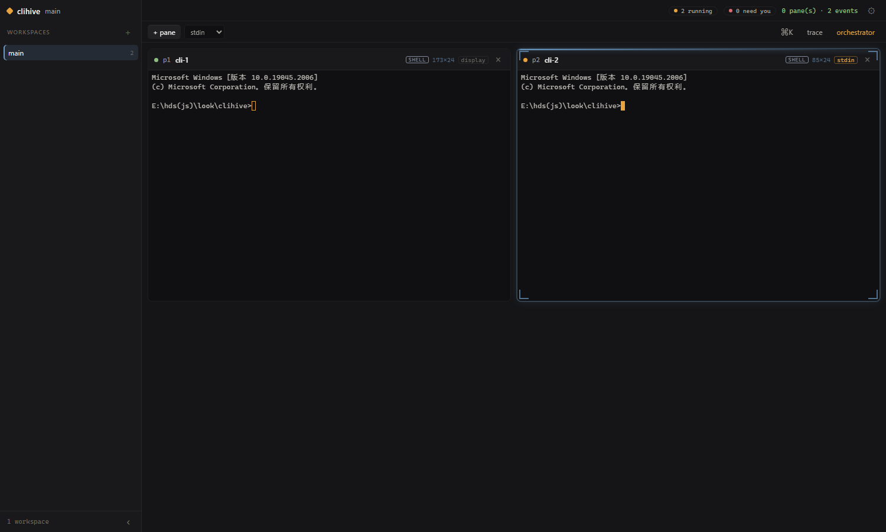
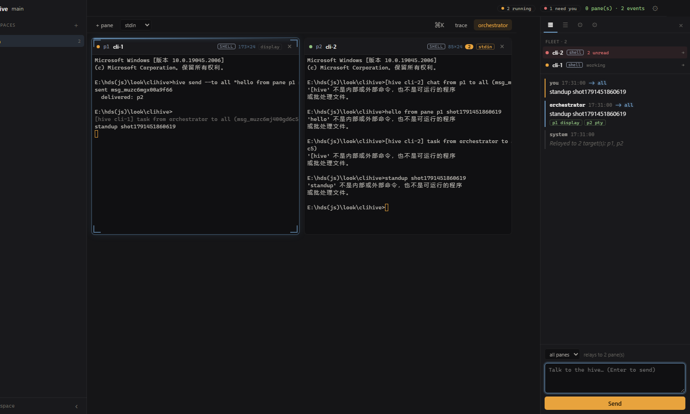
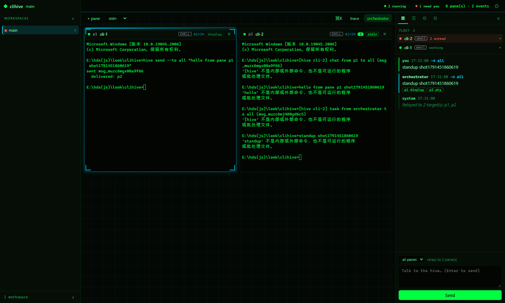
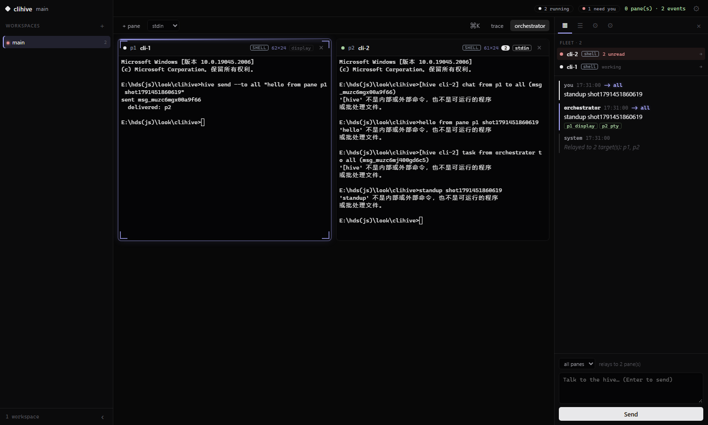
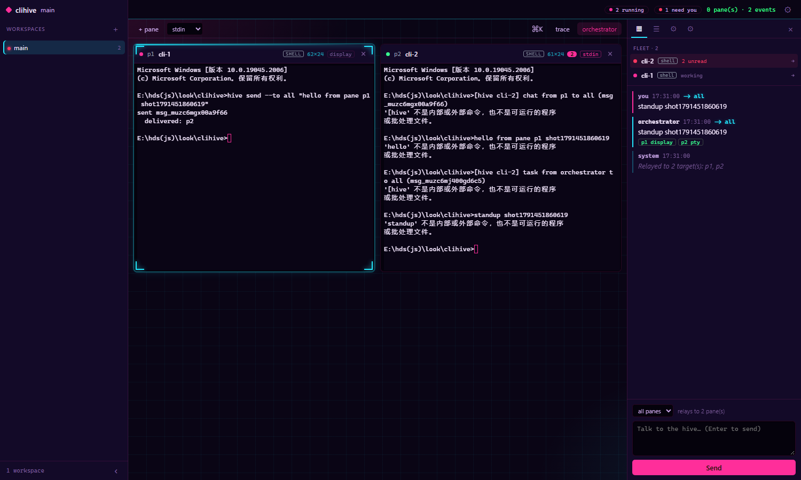
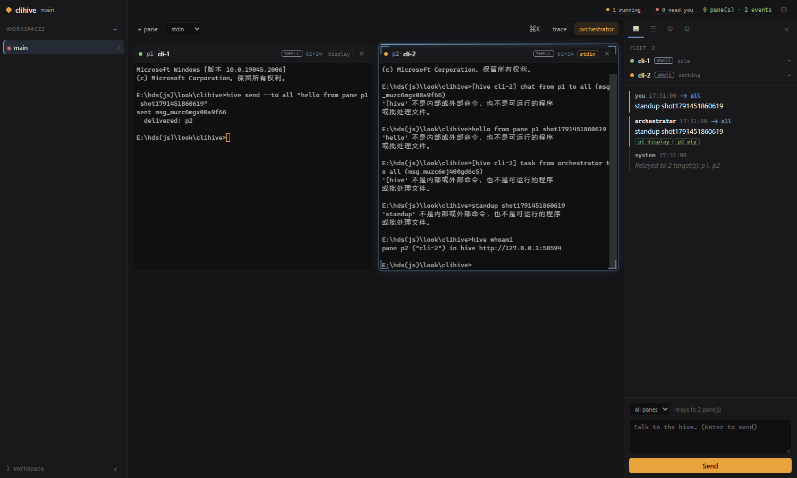
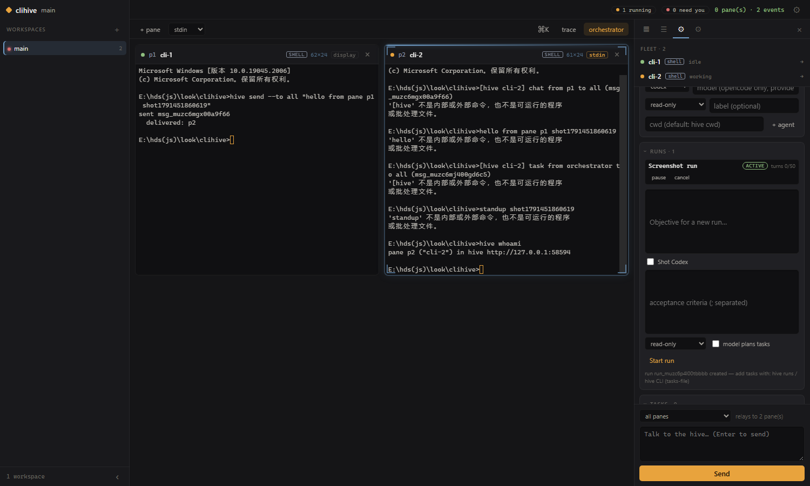
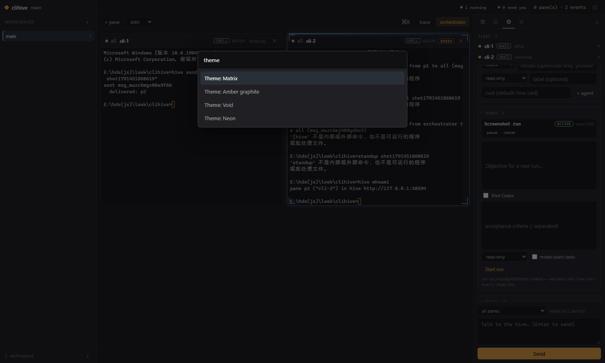
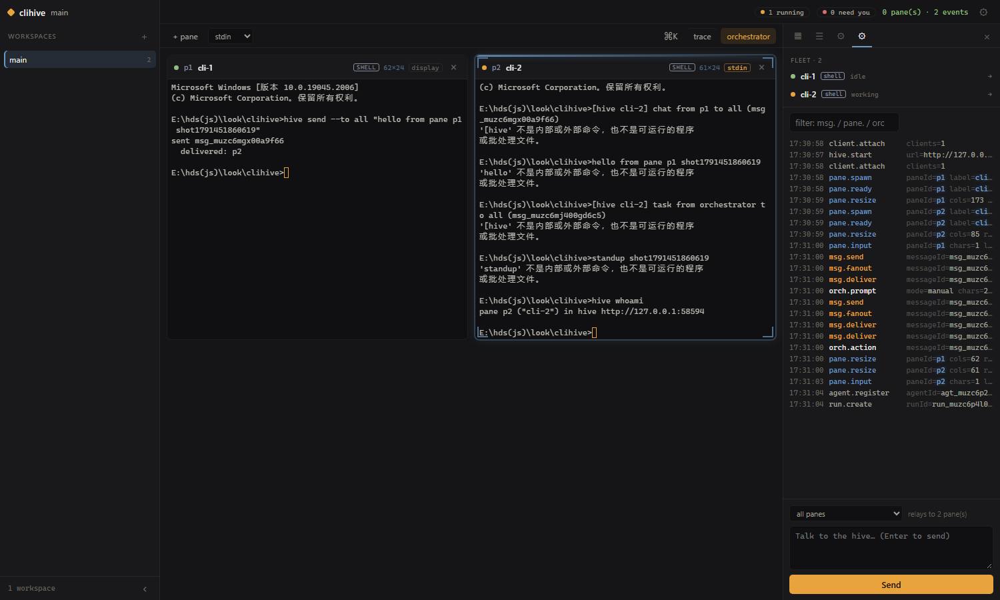
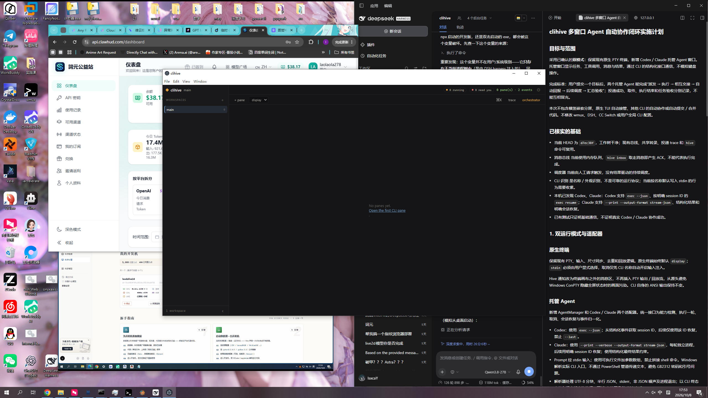

# clihive

**[中文文档](README.zh-CN.md)** | **[测试指南 / Testing Guide](TESTING.md)**

A workspace multiplexer for CLI agents. One window holds many small CLI panes.
A hideable orchestrator window on the right talks to all of them at once and
coordinates their work. Every message lands on a shared transcript that any
pane can read, and every delivery is traced, so you can always answer:
*did that pane actually receive it?*

On top of the terminals, clihive runs **managed agents**: codex, claude and opencode
driven through their structured CLI interfaces (not keyboard simulation),
working on persisted tasks with permission boundaries, a durable message
queue, and an operator review gate. Two modes, one window: your native
terminal panes stay manual; managed agent panes are orchestrated.

```
┌─────────────────────────── titlebar 36px ────────────────────────────┐
├──────────┬───────────────────────────────────┬───────────────────────┤
│          │  toolbar: + pane · mode · ⌘K · ⟳  │ Fleet · 3             │
│  sidebar │                                   │  ● p1 cli-1  working →│
│  240px   │   ┌─────────┐   ┌─────────┐       │  ● p2 cli-2  idle    →│
│ workspaces  │  cli-1   │   │  cli-2   │       │  ● p3 cli-3  2 unread→│
│          │   ├─────────┤   ├─────────┤       ├───────────────────────┤
│          │   │  cli-3   │   │  cli-4   │       │ Orchestrator          │
│          │   └─────────┘   └─────────┘       │ (chat|shared|trace)   │
│          │        hero terminal grid          ├───────────────────────┤
│          │                                   │ composer → all panes  │
├──────────┴───────────────────────────────────┴───────────────────────┤
│  activity trace drawer (Ctrl+Shift+T)                                │
└──────────────────────────────────────────────────────────────────────┘
```

## 界面预览 / Interface Preview

All screenshots below are captured from the **real, running UI** by
[`scripts/screenshots.mjs`](scripts/screenshots.mjs) (headless Chromium driving a live
`HiveServer` with real PTYs) — not mockups. Re-run with `npm run screenshots`.

| 主界面（默认琥珀石墨）/ Main Interface | 调度器展开 + 真实投递回执 / Orchestrator + real receipts |
|:---:|:---:|
|  |  |

**四种主题 / Four themes**（同一真实场景 / same real scene）

| Matrix | Void | Neon |
|:---:|:---:|:---:|
|  |  |  |

| 窗格内 hive CLI / `hive whoami` in a pane | 协作面板 / Collaboration panel |
|:---:|:---:|
|  |  |

| 命令面板 (Ctrl+K) / Command palette | 活动追踪抽屉 / Activity trace drawer |
|:---:|:---:|
|  |  |

**桌面应用 / Desktop app**（打包 exe 的真实窗口 / real window from the packaged exe）

| 桌面窗口 / Desktop window |
|:---:|
|  |

## What it does

- **Grid of CLI panes.** Each pane is a real PTY (your shell, or an agent CLI
  like `claude` / `codex`). Panes tile; the focused pane is ringed in amber.
- **Per-CLI adaptation.** The hive recognizes what each pane runs — codex,
  claude, gemini, qwen, aider, opencode, cline, amp, goose, dsh, shells, node,
  python — from its command line (`src/server/cli-profiles.js`). The pane wears
  that CLI's badge and accent color, and its safe delivery default is chosen
  for it: programs that read stdin as their prompt can opt into `stdin`
  delivery (typed lines are CR-terminated so Windows ConPTY actually releases
  them to the child); shells and unknown tools get non-destructive `display`
  painting. Full-screen TUIs (like an interactive codex/claude session) are
  never fed simulated keystrokes — orchestrate those as *managed agents*
  instead (below).
- **Managed agents (dual mode).** Register a codex or claude agent; it runs
  headless through its structured CLI (`codex exec --json`, `claude -p
  --output-format stream-json`), one task at a time, inside a permission
  boundary. Tasks persist across restarts, results come back as validated
  JSON, "done" only ever means *awaiting review*, and an operator approves
  with evidence. See [Managed collaboration](#managed-collaboration).
- **Key fields light up.** The shared transcript highlights `from` / `to` and
  badges the message kind; trace rows render every field as a dim key + lit
  value, with the load-bearing ones (paneId, target, channel, ok, held,
  reason) glowing so a scrolling delivery chain stays skimmable.
- **A hideable orchestrator.** The right-hand window (Ctrl/Cmd+J) addresses one
  pane or the whole hive. In manual mode it relays what you type. Point it at an
  OpenAI-compatible endpoint and a model coordinates instead.
- **Pane-to-pane talk.** Inside any pane, `hive send --to all "..."` or
  `--to p3`. Every pane sees the shared transcript, so sub-agents can follow
  each other's work.
- **A delivery trace.** Send → fanout → deliver → ack, recorded as JSONL and
  streamed to the trace views. The trace is the observability contract: it
  names the channel, the target, and whether it landed.

## The window

The layout keeps the terminals as the hero and pushes chrome to the edges:

- **Titlebar (36px).** Workspace name, live vitals (`N running`, `N need you` —
  shown only when non-zero, click to jump to the pane) and connection state.
- **Sidebar (240px).** Workspaces only. A workspace is a *view filter* over the
  hero grid: switching shows just that workspace's panes, and panes you spawn
  land in the active one. A red dot on a workspace row means a pane inside it is
  waiting on you. Collapsible with Ctrl/Cmd+B; a rail button brings it back.
- **Hero.** The pane grid. The focused pane carries a steel-blue top edge and
  glow so you can find it without reading labels. Panes tile responsively.
- **Mission-control deck (right, 326px).** Tabs across the top. The **Fleet**
  roster sits above the orchestrator thread: one row per pane with a status dot
  (amber = working, green = idle, grey = exited, red = needs you), a monospace
  activity line and a `→` jump affordance. Rows needing attention sort to the
  top. Fleet always spans **every** workspace — a pane needing input is never
  hidden by a filter; its row is tagged with its workspace and clicking it
  switches there first. Other tabs: shared transcript and the activity trace
  (filterable).
- **Command palette (Ctrl/Cmd+K).** Fuzzy search over commands and panes:
  spawn a pane, switch theme, toggle panels, jump to a pane.
- **Trace drawer (Ctrl/Cmd+Shift+T).** The full event stream along the bottom.

### Colour grammar

Two accents only, so state is legible at a glance: **amber** means alive /
action / needs attention (running dots, primary button, cursor, unread count);
**steel blue** means navigation / focus (focused pane edge, active tab, links,
focus ring). Everything else is warm graphite. One deliberate exception is
*identity*: each recognized CLI paints its pane badge and id in its own brand
accent (codex green, claude coral, gemini blue, qwen violet…). Identity never
encodes state — state stays amber/blue.

### Appearance

The ⚙ button in the titlebar (or `Appearance settings` in the palette) opens
the settings popover. Choices persist in `localStorage` and survive reloads:

| setting | options |
|---------|---------|
| **Theme** | `Amber graphite` (default warm neutral) · `Matrix` (phosphor green `#00FF41` + cyan) · `Void` (colourless near-black) · `Neon` (cyberpunk — hot magenta `#FF2E9A` + electric cyan on deep violet, gradient focus ring, pulsing primary button) |
| **Background image** | import any image up to 8 MB; stored as a data URL. Panels turn translucent so it reads through. |
| **Image fit** | `Fill` (cover, crop to window) · `Fit whole image` (letterboxed — use this for 16:9 wallpapers) · `Stretch` |
| **Image strength** | how far the image shows through the UI (0–70%) |
| **CRT scanlines** | 1px scanline overlay across the whole window |
| **Glow effects** | light bloom on running dots, the focused pane edge and (in Matrix) a slow CRT flicker; honours `prefers-reduced-motion` |

Switching theme re-paints every open terminal's palette live — no pane restart.

## Delivery: how a message actually reaches a pane

This is the part that matters, so it is explicit. A pane has one of two modes,
chosen when it is created — or chosen *for* it by its recognized CLI flavor:
agent CLIs (codex, claude, gemini, …) default to `stdin` because that is where
their prompt lives; shells, interpreters and unknown tools default to `display`
because anything on their stdin would be executed.

| mode | what happens | when to use it |
|------|--------------|----------------|
| `display` *(default for shells & unknown)* | The message is **painted into the pane's viewport**. The child process is never touched, so a plain shell will not try to execute the text. | shells, REPLs, anything that treats stdin as commands |
| `stdin` *(default for recognized agents)* | The message is **typed into the process's stdin**, line-terminated with the platform's Enter — CR on Windows (ConPTY buffers typed input until it sees CR; a bare LF never reaches the child), LF on POSIX. | programs that read stdin as their prompt |

For a *structured* conversation with codex/claude, do not type into their
TUIs at all — register them as [managed agents](#managed-collaboration) and
let the hive drive their headless CLI interfaces with durable queues and
receipts.

Both modes also queue the message for **pull**: `hive inbox` inside the pane
returns the message and acknowledges it. That pull is the acknowledgement —
it proves an agent actually read the message, even if it was mid-turn when the
push landed.

### Nothing paints over a full-screen app

A `display` message is painted into the pane's viewport. That is safe for a
shell, but a full-screen TUI (codex, claude, vim, less) owns the screen and
repaints by absolute cursor position, only redrawing the cells it changed.
Foreign text written into its buffer therefore stays on screen as garbage woven
through its own frame — the tool's context appears to overlap itself.

So the hive tracks the terminal modes each pane's output stream has switched on
(`src/server/output-modes.js`) and **holds** a `display` message while an
alternate screen is active, painting it the moment the app gives the screen
back. The pane header shows `◈ N held` while anything is waiting, and the
delivery trace records `held: true` with `reason: "alternate-screen"`. Nothing
is lost in the meantime: the message is on the shared transcript, in the deck,
and pullable with `hive inbox`.

Mode state is reconstructed from the byte stream rather than read from the
browser's terminal object, because on Windows the PTY runs through ConPTY, which
consumes the child's `?1049h` itself and renders the TUI — so the client-side
buffer type never reports "alternate".

### Each byte is painted exactly once

A pane's output reaches the window by two paths: the live broadcast, and the
scrollback replay that answers a subscribe. Without a shared coordinate system
they paint the same bytes twice — a shell shows doubled lines, and a TUI smears
one frame over another. Every frame therefore carries its `[from,to)` range in
the pane's own character stream, a window paints each byte once, and a replay
**resets and repaints** from the window instead of appending. The replay is also
prefixed with a mode preamble when the app entered the alternate screen before
the window starts, so the viewer is never left on the normal buffer while
absolute-positioned frames arrive.

Panes are spawned at the size the grid will actually show them at, so a TUI does
not draw its opening frames for one geometry and then repaint for another.

## Managed collaboration

The dual-mode core: the terminal panes above stay manual; **managed agents**
run real work with guarantees a terminal cannot offer. An agent is a headless
codex/claude process the hive drives through its structured CLI — never
keystrokes into a TUI.

- **Adapters, verified against real CLIs.** Only codex, claude and opencode are
  *adapted*; every other CLI is merely *recognized* for styling (pane badge /
  colour / default delivery mode) and cannot be managed:
  - `codex-cli 0.160.0` — `codex exec --json --skip-git-repo-check -C <cwd>
    --sandbox <profile> --output-schema <file>`, prompt on stdin, session
    resume via `codex exec resume <SESSION_ID> -`.
  - `claude 2.1.287 (Claude Code)` — `claude -p --verbose --output-format
    stream-json --json-schema <inline>`, `--permission-mode plan` for
    read-only / `acceptEdits` + explicit `--allowedTools` for workspace-write,
    `--add-dir <cwd>`, `--resume <id>`.
  - `opencode 1.18.34` — `opencode run --pure --format json --agent plan|build
    --dir <cwd> [-m provider/model] [-s <session>]`, prompt on stdin.
    opencode has **no structured-output flag**, so the result contract rides in
    the prompt and the adapter extracts the JSON object from the final message
    (bare, fenced, or surrounded by prose); the server re-validates the shape.
    Permissions are enforced by opencode itself via `OPENCODE_CONFIG_CONTENT`
    (read-only: edit/bash/webfetch denied; workspace-write: edit/bash allowed;
    `external_directory` always denied; `--auto` is never passed). Register with
    `hive agents add opencode --model provider/model`: opencode's built-in
    default model is rejected on some machines, so pick one that works for you.
    Caveat: in workspace-write opencode's bash tool is not path-confined (same
    trust level as claude's Bash).
  - Hard rules: prompt via stdin only, no shell interpretation, no
    danger/bypass/approve-for-me flags, unknown permission profiles degrade to
    read-only. codex and claude passed a real end-to-end acceptance run
    (2026-10-07, `docs/acceptance-real-2026-10-07.md`); opencode passed its own
    (`docs/acceptance-opencode-2026-10-07.md`) with the limits stated there.
  - **Not adapted:** cline (3.0.62 installed here, but its headless run needs
    re-authentication on this machine, so nothing could be verified; its
    `--json` / `-p` / `--id` / `--auto-approve` flags exist but are unproven
    here) and zcode (not installed, interface unknown). Both are recognized
    only as panes (cline) or unknown CLIs (zcode).
- **Permission boundary.** Effective permission = intersection of the agent's
  profile and the run's profile, default read-only. Model-generated tasks can
  never elevate it. Denials surface as `permission_denied` events and the
  agent must report itself blocked.
- **Persisted state.** Agents/runs/tasks/messages/receipts live in a
  checksummed JSONL journal under `~/.clihive/collab` (CAS on every write).
  A restart recovers in-flight tasks as `uncertain`; retry requires operator
  confirmation that the previous process stopped and side effects were
  reviewed.
- **Review gate.** A task reporting `done` lands in `awaiting_review` — never
  `completed`. The operator approves with evidence or rejects with a reason.
  Peer messages are durable (at-least-once) and ride the recipient's next
  turn; message-turns are service-reviewed automatically.
- **Budgets.** Per-run limits: concurrency, decisions, agent turns, task/run
  timeouts, handoff depth, messages per turn. Exhaustion pauses the run with
  a `budget-exhausted:<limit>` question instead of burning on.
- **Operators.** The right deck's **⚙ collab** tab (register agents, start
  runs, pause/cancel, approve/reject tasks, answer blocked questions, live
  agent event stream) and the `hive` CLI below. The optional planner (needs a
  model endpoint) turns an objective into ≤12 tasks with observable acceptance
  criteria and an independent verification task.

## Run it

```bash
npm install
npm start
```

Then open the printed URL (`http://127.0.0.1:7420/?token=…`). Spawn panes with
the **+ CLI pane** button. The trace file lives at `~/.clihive/trace.jsonl`.

### Desktop app (Windows exe)

```bash
npm run desktop     # run the Electron shell in dev
npm run build       # package: dist/clihive Setup 1.0.0.exe (installer) + dist/clihive 1.0.0.exe (portable)
```

The exe is a thin Electron shell: it spawns the server on your system
Node.js (≥ 20, with `node-pty` prebuilt for it) and opens the UI in a native
window — closing the window kills the server and every agent it spawned.
The bundled `bin/hive` is put on the server's `PATH`, so `hive` works inside
panes without a global npm install.

### The `hive` CLI (inside a pane)

Every pane is spawned with `CLIHIVE_URL`, `CLIHIVE_TOKEN`, `CLIHIVE_PANE_ID`
and `hive` on its `PATH`, so no setup is needed inside a pane:

```bash
hive whoami                      # which pane am I
hive panes                       # who else is in the window
hive send --to all "build green" # broadcast to every other pane
hive send --to p2 "take the API" # one pane
hive ask "who is free?"          # talk to the orchestrator
hive inbox                       # read + acknowledge what was sent to me
hive read                        # the shared transcript for this window
hive trace --message msg_xxx     # how a message actually travelled
hive trace --prefix msg.         # the message lifecycle, live
```

Collaboration commands (managed agents — work from anywhere with the token):

```bash
hive capabilities                        # which managed CLIs this machine really has
hive agents                              # list managed agents + state
hive agents add codex --label review --cwd C:\repo --permission read-only
hive agents add opencode --model openrouter/deepseek/deepseek-chat --cwd C:\repo
hive run "audit the auth module" --agents agt_x,agt_y --plan --criteria "no secrets logged"
hive run "fix issue 42" --agents agt_x --tasks-file tasks.json
hive runs                                # list; also: pause|resume|cancel <runId>|respond <runId> <text>
hive tasks --run run_x                   # list; also: show <id>
hive tasks review <id> --approve --evidence "tests green, diff reviewed"
hive tasks review <id> --reject --reason "missed the edge case in X"
hive tasks cancel <id> --reason "obsolete"
hive tasks retry <id> --reason "process confirmed stopped" --stopped --reviewed
```

## Orchestrator

The orchestrator runs in one of two modes:

- **manual** (default): whatever you type is relayed to the addressed panes.
  Zero setup.
- **model**: set `CLIHIVE_BASE_URL`, `CLIHIVE_API_KEY`, `CLIHIVE_MODEL` before
  starting. The model sees the pane roster and shared transcript and replies
  with `{"say": "...", "actions": [{"to": "p2", "kind": "task", "text": "..."}]}`
  which are dispatched to the panes.

## Keyboard

| keys | action |
|------|--------|
| Ctrl/Cmd + K | command palette (commands + jump to pane) |
| Ctrl/Cmd + J | toggle the orchestrator window |
| Ctrl/Cmd + B | toggle the workspace sidebar |
| Ctrl/Cmd + Shift + T | toggle the activity trace drawer |
| Enter (in composer) | send |
| Shift + Enter | newline |
| Esc | close the palette / settings popover |

## HTTP API

Every route is loopback-only and needs the startup token (`Authorization: Bearer`,
`?token=`, or `x-clihive-token`). The `hive` CLI is a thin wrapper over these.

| route | method | purpose |
|-------|--------|---------|
| `/api/send` | POST | publish a message; returns `messageId` + per-target delivery receipts |
| `/api/inbox?pane=p1[&peek=1]` | GET/POST | drain (or peek) a pane's pending messages; draining emits `msg.ack` |
| `/api/transcript[?pane=p1][&limit=50]` | GET | shared transcript, whole hive or one pane |
| `/api/panes` | GET / POST | list panes / spawn one (`{command,args,cwd,deliveryMode,label}`) |
| `/api/panes/:id` | DELETE | kill a pane |
| `/api/trace[?message=][?prefix=][?limit=200]` | GET | trace events, all / one message / one kind prefix |
| `/api/delivery?message=msg_xxx` | GET | full delivery report: pushed, acked, channels, reasons |
| `/api/orchestrator[?limit=100]` | GET | orchestrator status + recent turns |
| `/api/orchestrator/ask` | POST | `{text, to}` — relay or ask the model |
| `/api/status` | GET | url, pane counts, orchestrator mode, client count, trace path, collaboration store status |
| `/api/agents/capabilities` | GET | real probe: resolved executable + version per provider |
| `/api/agents` | GET / POST | list / register managed agents (`{provider,label,cwd,permissionProfile}`) |
| `/api/agents/:id/messages` | POST | durable peer message (202; rides the agent's next turn) |
| `/api/runs`, `/api/runs/:id` | GET / POST | list·inspect / create (`plan:true` uses the model planner) |
| `/api/runs/:id/state`, `/api/runs/:id/respond` | POST | pause·resume·cancel / answer a blocked run's question |
| `/api/runs/:id/tasks`, `/api/tasks[/:id]` | GET / POST | list·add / inspect tasks (with receipts) |
| `/api/tasks/:id/review`, `/cancel`, `/retry` | POST | approve (`evidence`) or reject / cancel / retry (needs stop + side-effect confirmation) |

The window itself connects over WebSocket at `/ws` and receives `hello`,
`pane.list`, `pane.created`, `pane.data`, `pane.exit`, `message`, `delivery`,
`trace` and `orch.reply` frames, plus (protocol v2, additive) `agent.update`,
`task.update`, `run.update` and `agent.event`; it sends `pane.create`,
`pane.input`, `pane.resize`, `pane.kill`, `pane.subscribe`, `message.send` and
`orch.ask`.

## Testing / 测试

详细的测试指南见 **[TESTING.md](TESTING.md)** / See **[TESTING.md](TESTING.md)** for the detailed testing guide.

```bash
npm test                    # unit/API tests incl. collaboration (fake CLIs — simulated, NOT proof of real collaboration)
                            # 单元/API 测试包括协作（假 CLI——模拟的，非真实协作的证明）
node scripts/smoke.mjs      # end-to-end with real PTYs: send, deliver, ack, stdin reader
                            # 用真实 PTY 端到端：发送、传递、确认、stdin 读取器
node scripts/verify-ui.mjs  # drives the real window in Chromium (incl. the collab panel)
                            # 在 Chromium 中驱动真实窗口（包括协作面板）
npm run check               # parse every source file / 解析每个源文件
node scripts/acceptance-real.mjs   # REAL codex + claude run; writes .artifacts evidence (needs both CLIs logged in)
                                   # 真实 codex + claude 运行；写入 .artifacts 证据（需要两个 CLI 登录）
node scripts/acceptance-opencode.mjs <provider/model>   # REAL opencode run (needs a working opencode model)
                                                        # 真实 opencode 运行（需要工作的 opencode 模型）
```

Simulated tests and real acceptance are reported separately on purpose. The
latest real-CLI record, including a failed first attempt, is
[docs/acceptance-real-2026-10-07.md](docs/acceptance-real-2026-10-07.md).

模拟测试和真实验收故意分开报告。最新的真实 CLI 记录，包括失败的第一次尝试，
在 [docs/acceptance-real-2026-10-07.md](docs/acceptance-real-2026-10-07.md)。

## Layout

```
src/
  shared/protocol.js   message + trace vocabulary, validation, formatting
  server/
    bus.js             shared transcript, fanout, delivery, acks
    panes.js           PTY lifecycle, scrollback, per-pane delivery
    output-modes.js    tracks terminal modes from the byte stream (alt screen)
    cli-profiles.js    recognizes each pane's CLI (identity, accent, safe default)
    tracer.js          append-only JSONL trace + in-memory ring
    orchestrator.js    the right-hand window: manual relay or model
    collaboration-*.js durable store, validation, task state machine, result
                       parsing, service (queue, scheduling, review, budgets)
    agent-runtime/     codex/claude/opencode adapters, JSONL parsing, CLI resolution,
                       turn prompt + result schema
    http.js            HTTP/JSON API + WebSocket + static serving
    index.js           entry point
  cli/hive.js          the command a pane uses to talk to the hive
  ui/                  the window (xterm.js, no build step)
bin/hive               shim so `hive` resolves inside a pane
```

## Security notes

- Binds to loopback only. The window authenticates with a token generated at
  startup (`~/.clihive/token`, mode 600) and handed to panes via the
  environment.
- `stdin` delivery writes to a process's input. Only use it for panes whose
  program reads stdin as a prompt; for a plain shell use the default `display`.
- Managed agents never receive the hive token or `CLIHIVE_PANE_*` variables
  (credential separation); their env carries only `CLIHIVE_MANAGED_AGENT=1` and
  their agent id. They run in the cwd you register, read-only by default;
  `workspace-write` requires both the agent and the run to opt in, and no
  danger/bypass/approve-for-me flag is ever passed to a CLI.
- Collaboration state fails closed: a corrupt journal poisons the store (HTTP
  503) rather than guessing; a second server on the same home is refused by a
  writer lock.

## License

MIT
